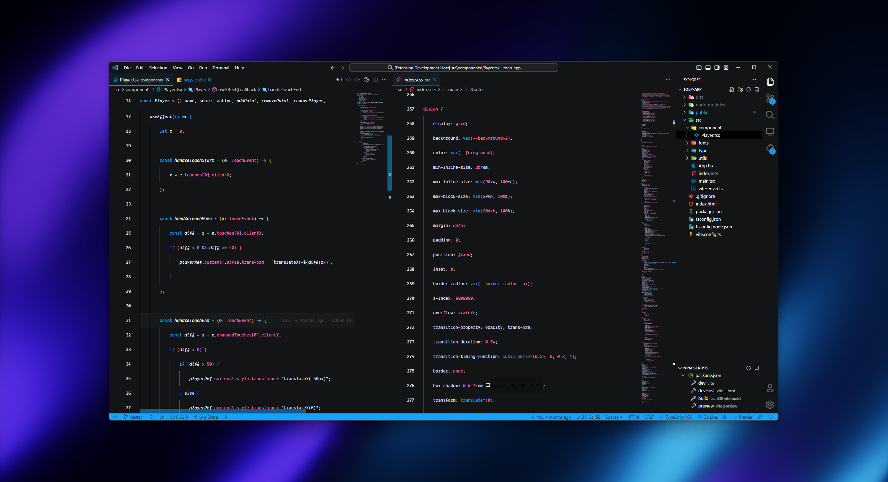
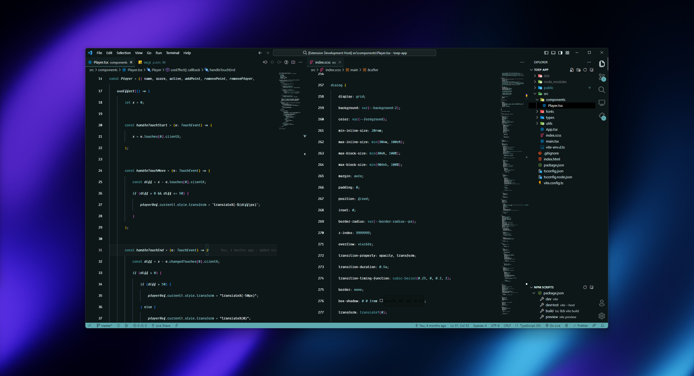
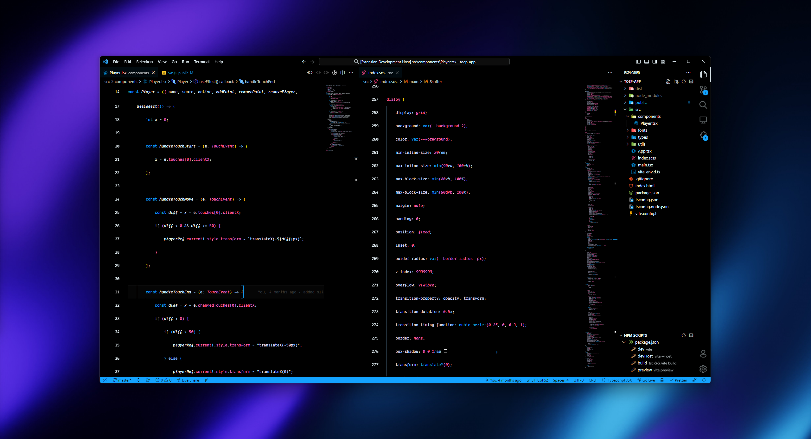
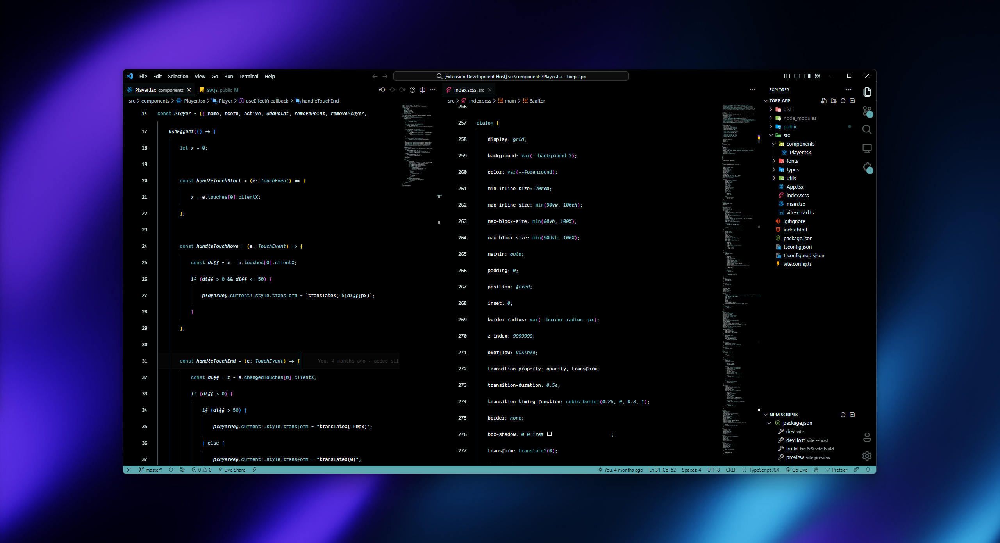

# Sto Theme for VS Code

[Install on VS Code Marketplace](https://marketplace.visualstudio.com/items?itemName=NSMNIA.sto-theme)

## Previews

_Sto Classic_

_Sto Green_

_Sto Classic Dark_

_Sto Green Dark_

# Features

-   Colors, italics, and subdued colors help you understand the code by using consistent coloring.
-   Leverages cursive if you're using [Dank Mono](https://philpl.gumroad.com/l/dank-mono), [Fira Code](https://github.com/tonsky/FiraCode) or [Cascade Code](https://github.com/microsoft/cascadia-code).

# Installation

1. Open **Extensions** sidebar panel in VS Code. `View → Extensions`
2. Search for `Sto Theme`,
3. Click **Install** to install it.
4. Code > Preferences > Color Theme > **Sto Classic**

Created by [NSMNIA](https://github.com/NSMNIA).
