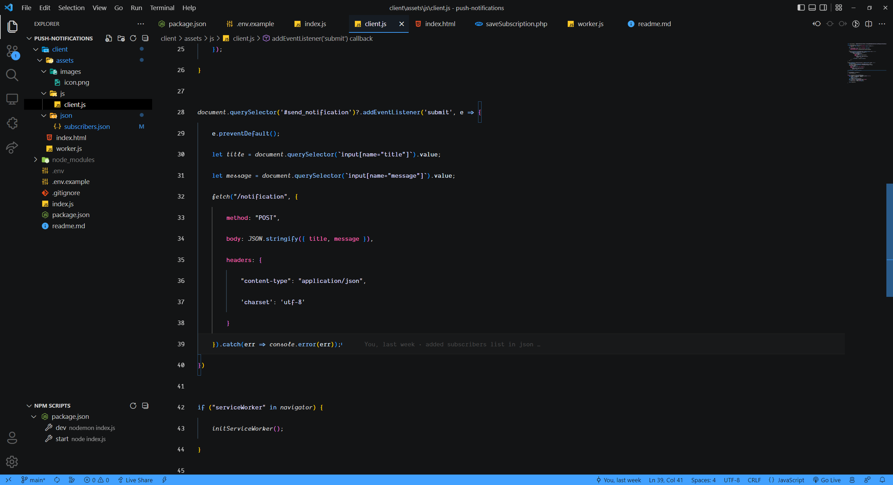
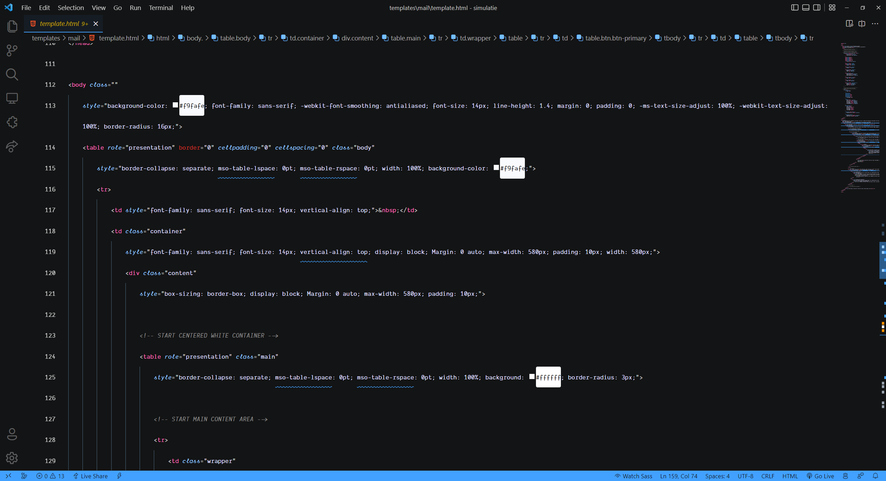
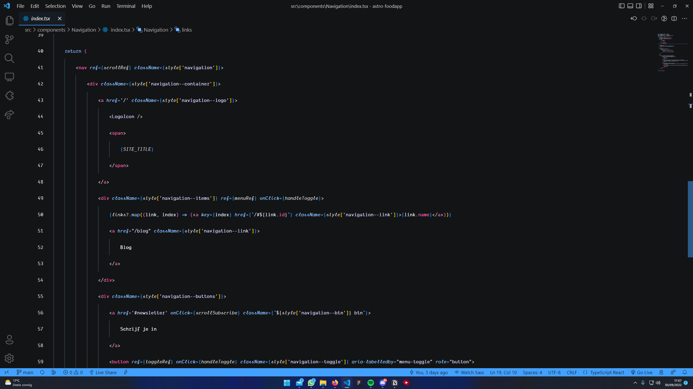

# Sto Theme

## Installation
Go to [Sto Theme](https://marketplace.visualstudio.com/items?itemName=NSMNIA.sto-theme) and install the theme. Then go to `File > Preferences > Color Theme` and select `Sto Theme`.

## Images
JavaScript

SCSS

HTML

TSX (React)

Created by [NSMNIA](https://github.com/NSMNIA).

